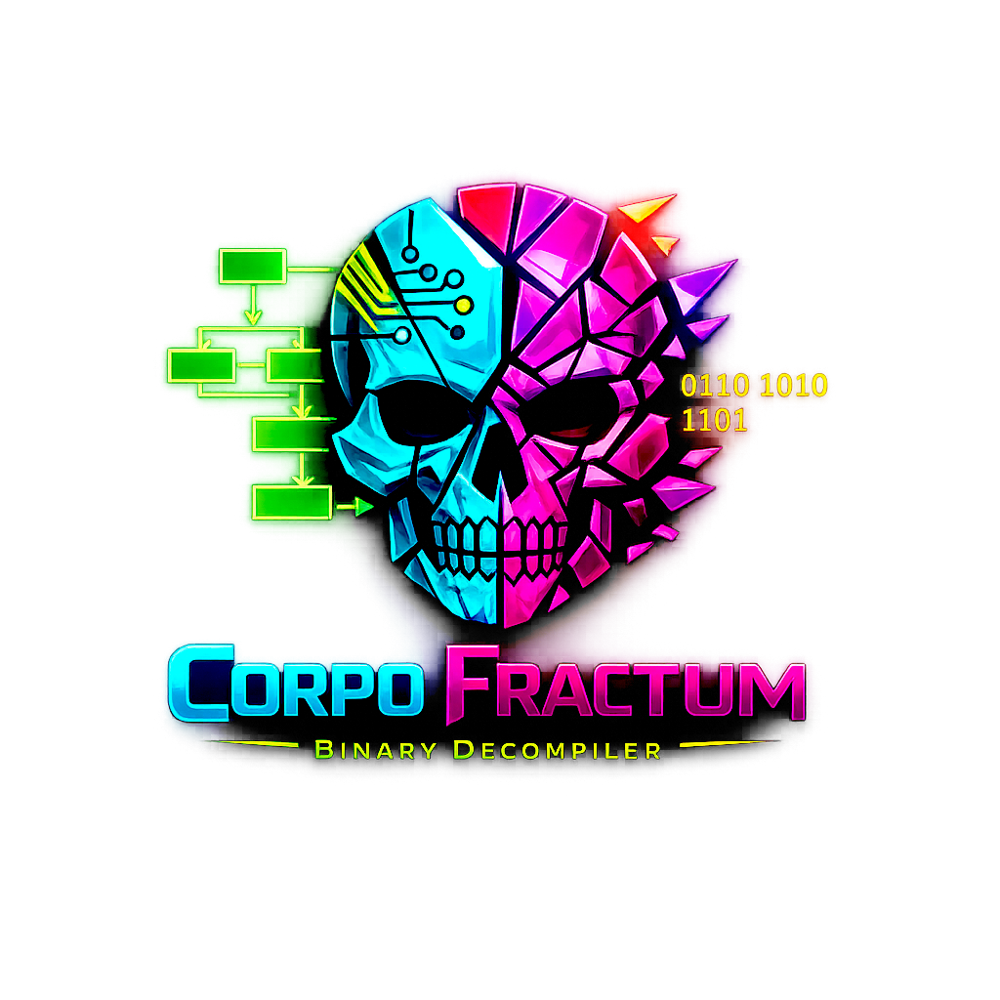

 ██████╗ ██████╗ ██████╗ ██████╗  ██████╗     ███████╗██████╗  █████╗  ██████╗████████╗██╗   ██╗███╗   ███╗
██╔════╝██╔═══██╗██╔══██╗██╔══██╗██╔═══██╗    ██╔════╝██╔══██╗██╔══██╗██╔════╝╚══██╔══╝██║   ██║████╗ ████║
██║     ██║   ██║██████╔╝██████╔╝██║   ██║    █████╗  ██████╔╝███████║██║        ██║   ██║   ██║██╔████╔██║
██║     ██║   ██║██╔══██╗██╔═══╝ ██║   ██║    ██╔══╝  ██╔══██╗██╔══██║██║        ██║   ██║   ██║██║╚██╔╝██║
╚██████╗╚██████╔╝██║  ██║██║     ╚██████╔╝    ██║     ██║  ██║██║  ██║╚██████╗   ██║   ╚██████╔╝██║ ╚═╝ ██║
 ╚═════╝ ╚═════╝ ╚═╝  ╚═╝╚═╝      ╚═════╝     ╚═╝     ╚═╝  ╚═╝╚═╝  ╚═╝ ╚═════╝   ╚═╝    ╚═════╝ ╚═╝     ╚═╝

                             ░▒▓ CORPO FRACTUM ▓▒░

                  From gods came man. From binary, came code.

        [ dissecting structure ]  [ lifting instructions ]  [ rebuilding meaning ]

-----------------------------------------------------------------------------------------------------------

## Overview

Corpo Fractum is an open-source binary decompiler targeting x86-64 ELF binaries first, with PE and Mach-O support on the roadmap. It lifts machine code to a typed SSA intermediate representation and emits readable C pseudo-code, with C++ and Rust backends also available.

The entire toolchain — loader, disassembler, IR, analysis, codegen and UI — is written in pure Rust.

---

## Current focus

| Area | Status |
|---|---|
| ELF 64-bit parsing | ✅ |
| x86-64 disassembly (Capstone, Intel syntax) | ✅ |
| CFG construction (3-pass, branch-aware) | ✅ |
| Function detection (symbols + call-site scan + jump tables) | ✅ |
| x86-64 instruction lifter → SSA IR | ✅ |
| Stack frame analysis (local variable naming) | ✅ |
| ASCII / C-string recognition | ✅ |
| C pseudo-code generation | ✅ |
| Dominator tree + natural loop detection | ✅ |
| GTK4 UI (explorer · code · graph panels) | 🚧 skeleton |

## Also supported

| Area | Status |
|---|---|
| ELF 32-bit parsing | ✅ |
| PE / PE+ parsing | ✅ |
| Mach-O / Fat binary parsing | ✅ |
| ARM64 disassembly | ✅ |
| C++ pseudo-code generation | ✅ |
| Rust pseudo-code generation | ✅ |
| Async analysis backend (Tokio) | ✅ |
| Dark theme | ✅ |

---



---

## Quick start

### Dependencies

```bash
# Debian / Ubuntu
sudo apt install libgtk-4-dev libcairo2-dev pkg-config

# Arch Linux
sudo pacman -S gtk4 cairo pkgconf

# Fedora
sudo dnf install gtk4-devel cairo-devel
```

### Build

```bash
cargo build --release
```

### Run

```bash
./target/release/corpo_fractum

# With debug logging:
RUSTDEC_LOG=debug ./target/release/corpo_fractum

# Filter logs by crate:
RUSTDEC_LOG=rustdec_analysis=debug,info ./target/release/corpo_fractum
```

### Tests

```bash
cargo test                       # all tests
cargo test -p rustdec-loader     # loader only
cargo test -p rustdec-disasm     # disassembler only
```

---

## Workspace layout

```
corpo_fractum/
├── Cargo.toml                   # workspace root
├── crates/
│   ├── rustdec-loader/          # ELF / PE / Mach-O parser      (goblin)
│   ├── rustdec-disasm/          # multi-arch disassembler        (capstone-rs)
│   ├── rustdec-ir/              # SSA intermediate representation
│   ├── rustdec-analysis/        # CFG, function detection, dominance, structuration
│   ├── rustdec-lift/            # x86-64 instruction lifter + frame analysis
│   ├── rustdec-codegen/         # C / C++ / Rust code generators
│   └── rustdec-plugin/          # Lua plugin engine              (mlua — stub)
├── rustdec-gui/                 # GTK4 application               (main binary)
└── tests/                       # integration tests
```

---

## Architecture

```
Binary file
    │
    ▼
rustdec-loader          ELF / PE / Mach-O → BinaryObject + StringTable
    │
    ▼
rustdec-disasm          Capstone → Vec<Instruction>
    │
    ▼
rustdec-analysis        CFG · function detection · dominance · structuration
    │
    ▼
rustdec-lift            x86-64 → SSA IR · stack frame analysis · string annotation
    │
    ▼
rustdec-codegen         IrModule → C / C++ / Rust pseudo-code
    │
    ▼
rustdec-gui             GTK4 · Cairo · Tokio
```

---

## Roadmap

- **MVP** (current) — ELF x86-64 · SSA IR · C codegen · stack frame naming · GTK4 skeleton
- **V1** — ARM64 / RISC-V lifting · improved type inference · interactive call graph · multi-file projects
- **V2** — Lua plugin API · AI-assisted renaming · dynamic analysis (ptrace)

---

## License

GPL v3.0
